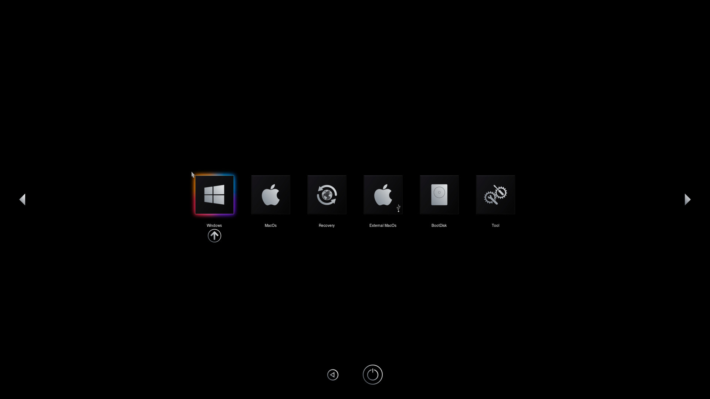

# BsxM1-rEFInd
A rEFInd theme built on the OpenCore theme by blackosx - BsxM1.

NOTE: external/internal/optical sub-icons not working yet.

**Credits** 
Original OpenCore theme: blackosx - BsxM1
The design of the BsxM1 theme is based on the original Apple image for their M1 chip